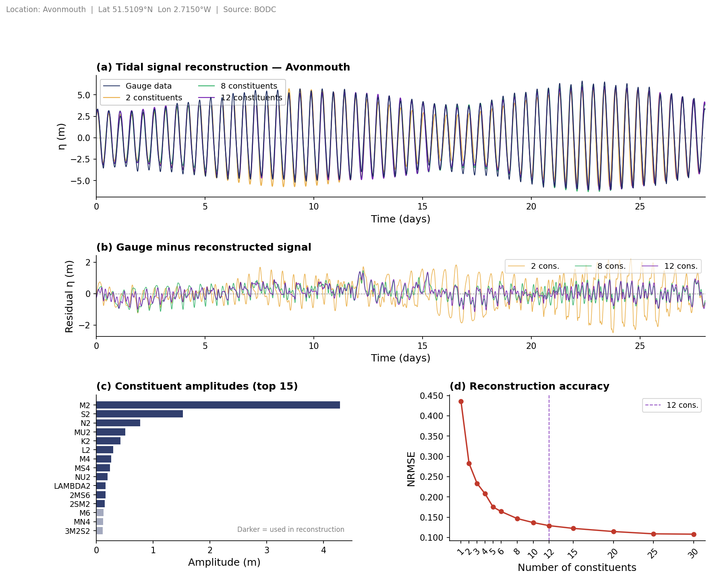

# Tidal Harmonic Analysis


A clean, reproducible Python workflow for **tidal harmonic analysis** of long-term sea-level records. Starting from raw BODC tide gauge data, the project extracts harmonic constituents, reconstructs the tidal signal with increasing numbers of constituents, and quantifies accuracy — providing a rigorous foundation for tidal energy resource assessment and coastal hydrodynamic modelling.

Demonstrated on **Avonmouth** (Bristol Channel, UK) — one of the highest tidal ranges in the world (~14 m spring range), with a strongly semi-diurnal character driven by near-resonant amplification in the Bristol Channel.

---

## Figure



**(a)** 28-day tidal signal: gauge data vs 2, 8, and 12-constituent reconstructions. Spring-neap modulation (~14-day period) is clearly visible.
**(b)** Residual (gauge − reconstructed): 2-constituent errors exceed 1 m; 12-constituent residuals are substantially smaller.
**(c)** Tidal constituent amplitudes — M2 dominates at 4.29 m, driven by resonance in the Bristol Channel funnel geometry.
**(d)** NRMSE vs number of constituents — sharp improvement up to ~12, then diminishing returns.

> The spring-neap cycle (~14 days) in panel (a) arises from the constructive/destructive interference of M2 and S2.

---

## Method

Tidal harmonic analysis decomposes the sea-surface elevation into a sum of sinusoidal components (constituents), each with a known astronomical frequency:

$$\eta(t) = h + \sum_{i} f_i A_i \cos\bigl[\omega_i t + (V_0 + u)_i - \phi_i\bigr]$$

| Symbol | Meaning |
|--------|---------|
| $h$ | mean surface level relative to the reference datum |
| $f_i$ | nodal correction factor — accounts for the long-period (~18.61 yr) modulation of constituent amplitude due to the lunar nodal cycle |
| $A_i$ | tidal amplitude of constituent $i$ |
| $\omega_i$ | angular frequency (rad s⁻¹) |
| $(V_0 + u)_i$ | equilibrium argument at $t = 0$: $V_0$ is the astronomical argument and $u$ is the nodal phase correction |
| $\phi_i$ | phase lag (rad) relative to the corresponding constituent at Greenwich |

Amplitudes and phase lags are estimated by least-squares harmonic analysis using the [`uptide`](https://github.com/stephankramer/uptide) library. The mean level $h$ is removed prior to fitting (the gauge record is de-meaned), and nodal corrections $f_i$ and $(V_0+u)_i$ are applied internally by uptide based on the record's reference epoch.

**39 constituents** are fitted, spanning four frequency bands:

| Band | Period | Key constituents |
|------|--------|-----------------|
| Diurnal | ~24 h | K1, O1, P1, Q1 |
| Semi-diurnal | ~12 h | **M2**, S2, N2, K2 |
| Compound / overtides | ~6–8 h | M4, MS4, MK3 |
| Higher harmonics | ~4 h and above | M6, M8 |

The reconstructed signal uses the top-N constituents ranked by amplitude. NRMSE (normalised by the standard deviation of the gauge record) quantifies reconstruction accuracy as a function of N.

---

## Site: Avonmouth

Avonmouth sits at the mouth of the Bristol Channel, which acts as a natural funnel that amplifies the oceanic tide through resonance. The Bristol Channel has the **second highest tidal range in the world** (~14 m spring range), exceeded only by the Bay of Fundy, Canada.

| Property | Value |
|----------|-------|
| Location | 51.51°N, 2.71°W |
| Mean spring range | ~12.3 m |
| Mean neap range | ~6.5 m |
| Dominant constituent | M2 — amplitude 4.29 m |
| Data period | Jan 2004 – Apr 2012 (8.3 years) |
| Data availability | ~98% after QC (281,304 / 288,384 observations retained) |
| Source | BODC UK National Tide Gauge Network |

---

## Workflow

```
Raw BODC gauge data  (15-min interval, 8.3 years)
         │
         ▼
   Quality control          Remove flagged samples (N / M / T flags), de-mean
         │
         ▼
   Harmonic analysis        Fit 39 constituents via least squares  [uptide]
         │
         ▼
   Signal reconstruction    Sum top-N constituent sinusoids
         │
         ▼
   NRMSE accuracy curve     Quantify reconstruction error vs N constituents
         │
         ▼
   fig_harmonic_analysis.png
```

---

## Project structure

```
tidal_analysis/
├── analyse.py          Entry point — runs the full workflow and saves the figure
├── core/
│   ├── io.py           BODC data loader and quality-control
│   ├── harmonic.py     Harmonic analysis and signal reconstruction (uptide)
│   └── metrics.py      Tidal energy metrics: PE, Hm0, tidal ranges, IQR
├── figures/
│   └── fig_harmonic_analysis.png
├── requirements.txt
├── LICENSE
└── README.md
```

---

## Installation

```bash
git clone git@github.com:pappas-k/Tidal-Harmonic-Analysis.git
cd Tidal-Harmonic-Analysis
pip install -r requirements.txt
```

---

## Usage

BODC gauge data can be downloaded from the [BODC data discovery portal](https://www.bodc.ac.uk/data/hosted_data_systems/sea_level/uk_tide_gauge_network/). Set the `DATA_FILE` and `START_DATE` in `analyse.py` to point to your gauge CSV, then run:

```bash
python3 analyse.py
```

The figure is saved to `figures/fig_harmonic_analysis.png`.

**Example output:**
```
Loading Avonmouth tide gauge data …
  281,304 / 292,128 observations retained  (96.3% availability,  8.3 years)
Performing harmonic analysis …
Reconstructing signals …
Computing NRMSE curve …
  Variance explained (12 cons.): 98.3%
Form factor  F = (K1+O1)/(M2+S2) = 0.0237  →  semi-diurnal

────────────────────────────────────────────────────
  Location       : Avonmouth  (51.5109°N, 2.715°W)
  Period         : Jan 2004 – Apr 2012  (8.3 yr)
  Availability   : 96.3%  (281,304 obs.)
  M2 amplitude   : 4.29 m
  Form factor    : 0.0237  (semi-diurnal)
  NRMSE (12 cons): 0.129  →  98.3% variance explained
  Figure         : figures/fig_harmonic_analysis.png
────────────────────────────────────────────────────
```

---

## Key results — Avonmouth (2004–2012)

Dominant constituent: **M2** (principal lunar semi-diurnal, period 12.42 h) at **4.29 m** amplitude — more than twice the next largest constituent (S2 at 1.53 m). This strong M2 dominance is characteristic of macrotidal sites with near-resonant basin geometry.

Reconstruction accuracy improves rapidly with the number of constituents:

| Constituents | NRMSE | Improvement vs previous |
|:---:|:---:|:---:|
| 1 | 0.436 | — |
| 2 | 0.283 | −35% |
| 4 | 0.208 | −26% |
| 8 | 0.147 | −29% |
| 12 | 0.129 | −12% |
| 30 | 0.108 | −16% |

12 constituents capture the bulk of tidal energy; the remaining error is primarily due to non-tidal (meteorological) variability not resolvable by harmonic methods.

**Tidal regime — Munk-Cartwright form factor**

The form factor classifies the tidal regime based on the relative strength of diurnal and semi-diurnal constituents:

$$F = \frac{K_1 + O_1}{M_2 + S_2}$$

| F | Regime |
|:---:|---|
| < 0.25 | Semi-diurnal |
| 0.25 – 1.5 | Mixed, predominantly semi-diurnal |
| 1.5 – 3.0 | Mixed, predominantly diurnal |
| > 3.0 | Diurnal |

For Avonmouth: **F = 0.024** → strongly **semi-diurnal**. Two high waters and two low waters occur each day with minimal diurnal inequality, consistent with the dominance of M2.

The top 3 constituents by amplitude:

| Rank | Constituent | Description | Amplitude (m) | Phase (rad) |
|:---:|:---:|---|:---:|:---:|
| 1 | M2 | Principal lunar semi-diurnal | 4.29 | 3.44 |
| 2 | S2 | Principal solar semi-diurnal | 1.53 | 4.52 |
| 3 | N2 | Larger lunar elliptic semi-diurnal | 0.77 | 3.20 |

---

## Limitations

- **Stationarity assumption.** Harmonic analysis assumes constituent amplitudes and phases are constant over the analysis period. Secular changes in mean sea level or tidal characteristics (e.g. due to sea-level rise or port construction) are not captured.
- **Non-tidal residual.** The remaining error after reconstruction (panel b) is dominated by non-tidal variability — storm surges, seiches, and river discharge — which harmonic methods cannot resolve.
- **Rayleigh criterion.** Two constituents can only be separated if the record length exceeds the Rayleigh period T_R = 2π / |ω₁ − ω₂|. With 8.3 years of data, all 39 constituents fitted here are well resolved, including closely spaced pairs such as S2 and K2 (T_R ≈ 182 days).

---

## Dependencies

| Package | Purpose |
|---------|---------|
| [`uptide`](https://github.com/stephankramer/uptide) | Tidal harmonic analysis and reconstruction |
| `numpy` | Numerical arrays |
| `pandas` | Data handling |
| `scipy` | Peak detection (`find_peaks`) |
| `matplotlib` | Plotting |

---

## Data

Tide gauge records sourced from the [British Oceanographic Data Centre (BODC)](https://www.bodc.ac.uk/) — UK National Tide Gauge Network.

---

## Author

**Konstantinos Pappas** — PhD researcher in tidal energy resource assessment.
GitHub: [pappas-k](https://github.com/pappas-k)
